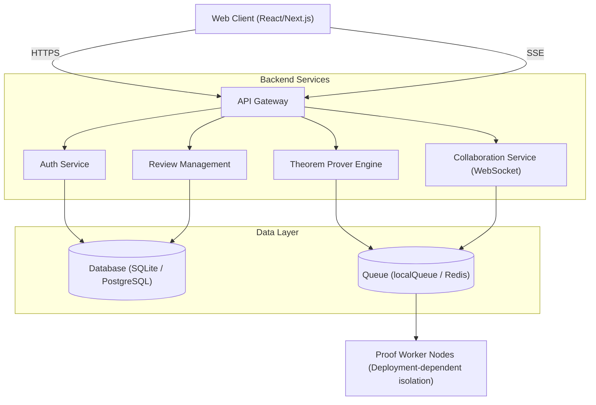

# Proofdesk Architecture

This document outlines the high-level architecture of Proofdesk, a collaborative platform for automated mathematical theorem proving and peer review.

---

## 1. High-Level Architecture Diagram

## 2. Core Components

### 2.1 Web Client
- **Framework:** Built using React.
- **State Management:** Utilizes modern state management for real-time collaboration.
- **Editor:** Integrates a custom syntax-highlighted editor specifically designed for mathematical notation and proof scripts.

### 2.2 API Gateway & Backend
- **Node.js/Express:** Handles all RESTful routing and API requests.
- **WebSocket Server:** Direct `WebSocketServer`/`WebSocket` implementation (used by `collaborationServer.ts`) for real-time collaboration.
- **Auth:** JWT-based authentication with role-based access control (Admin, Reviewer, Contributor).

### 2.3 Theorem Prover Engine
- **Workers:** Computations for proof verification are offloaded to worker nodes. Worker isolation is deployment-dependent.
- **Queue & State:** Queue-based dispatch for verification tasks. Uses `localQueue` as a fallback when shared state is disabled or unavailable, with Redis as an optional shared state provider for distributed deployments.

### 2.4 Data Layer
- **Database:** Supports SQLite (default behavior via `file:./dev.db`) alongside PostgreSQL (qualified for production deployments). Handles storing users, proofs, comments, and review histories.
- **Prisma ORM:** Used for type-safe database access and migrations (configured in `backend/src/services/db.ts`).

## 3. Data Flow: Proof Submission

1. **Write:** User writes a proof in the Web Editor.
2. **Submit:** Client sends the proof script to the API via REST.
3. **Queue:** The API pushes the verification task to the active queue (`localQueue` or Redis).
4. **Process:** A Worker Node picks up the task, runs the verification, and updates the status in the database.
5. **Notify:** The build endpoint streams results back to the client via Server-Sent Events (SSE), utilizing `line` and `done` events. The Collaboration Service WebSocket may also broadcast results to active collaborators.

---
*Note: This architecture is subject to change as the platform evolves.*
