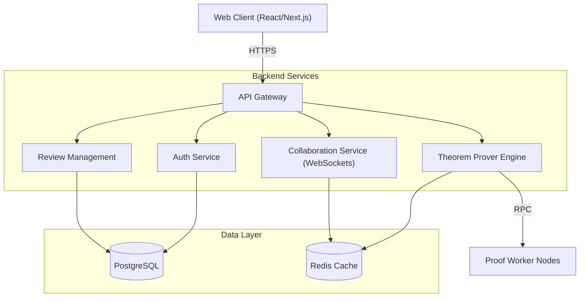

# Proofdesk Architecture

This document outlines the high-level architecture of Proofdesk, a collaborative platform for automated mathematical theorem proving and peer review.

---

## 1. High-Level Architecture Diagram

## 2. Core Components

### 2.1 Web Client
- **Framework:** Built using React.
- **State Management:** Utilizes modern state management for real-time collaboration.
- **Editor:** Integrates a custom syntax-highlighted editor specifically designed for mathematical notation and proof scripts.

### 2.2 API Gateway & Backend
- **Node.js/Express:** Handles all RESTful routing and API requests.
- **WebSocket Server:** Powered by Socket.io for real-time collaboration and live feedback from the Prover Engine.
- **Auth:** JWT-based authentication with role-based access control (Admin, Reviewer, Contributor).

### 2.3 Theorem Prover Engine
- **Workers:** Computations for proof verification are offloaded to isolated worker nodes to prevent blocking the main event loop.
- **Caching:** Uses Redis to cache previously verified sub-proofs and lemmas to significantly speed up compilation.

### 2.4 Data Layer
- **PostgreSQL:** The primary relational database for storing users, proofs, comments, and review histories.
- **Prisma ORM:** Used for type-safe database access and migrations.

## 3. Data Flow: Proof Submission

1. **Write:** User writes a proof in the Web Editor.
2. **Submit:** Client sends the proof script to the API via REST.
3. **Queue:** The API pushes the verification task to a Redis queue.
4. **Process:** A Worker Node picks up the task, runs the verification, and updates the status in PostgreSQL.
5. **Notify:** The Collaboration Service pushes the result back to the client via WebSockets in real-time.

---
*Note: This architecture is subject to change as the platform evolves.*
