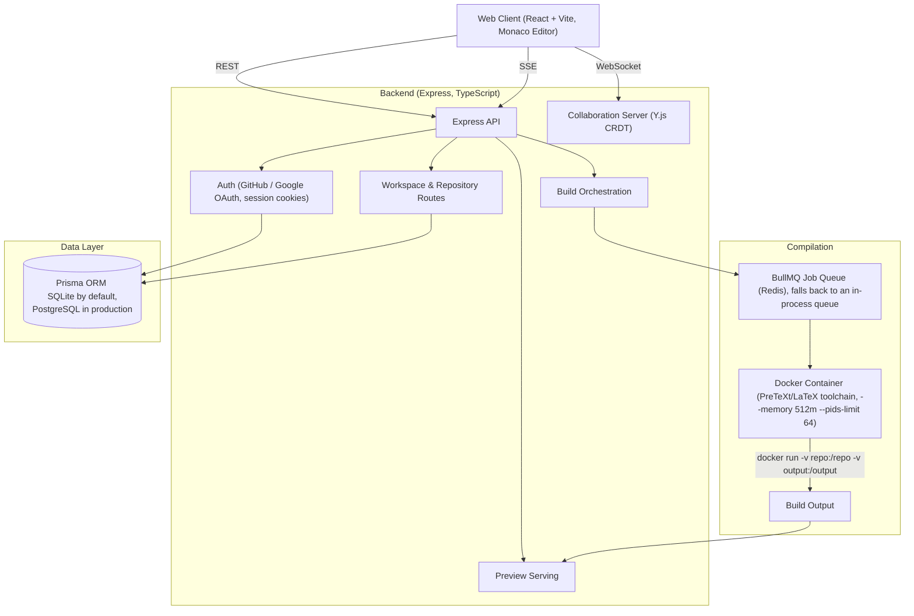

# Proofdesk Architecture

This document outlines the high-level architecture of Proofdesk, a collaborative web IDE for authoring and compiling PreTeXt/LaTeX textbooks stored in GitHub repositories.

---

## 1. High-Level Architecture Diagram

## 2. Core Components

### 2.1 Web Client (`frontend/`)
- **Framework:** React + Vite + TypeScript. Dev server runs on port 3000 (`frontend/vite.config.ts`).
- **Editor:** Monaco Editor, with a custom PreTeXt AST parser/outline pane and syntax tooling.
- **In-browser compilation:** Pyodide (Python compiled to WebAssembly) runs a fast-preview PreTeXt→HTML pass client-side, for instant feedback without a server round trip.
- **Collaboration:** Y.js CRDT bindings (`y-monaco`, `y-protocols`) sync editor state over a WebSocket connection to the backend's collaboration server.

### 2.2 API & Auth (`backend/src/routes/`, `backend/src/middleware/auth.ts`)
- **Framework:** Express (TypeScript). Routes: `auth`, `workspace`, `repository`, `build`, `preview`, `import`, `team`, `system`.
- **Auth:** GitHub OAuth and Google OAuth, plus a local-test mode for development without real OAuth credentials. Sessions are cookie-backed (`authSessionStore`), not JWT-based.
- **Admin access:** a small number of endpoints (e.g. `/monitoring/events`) are gated by `requireAdmin`, which checks the authenticated session's GitHub login against a `PROOFDESK_ADMIN_LOGINS` allow-list — there is no general role system (no "Reviewer"/"Contributor" roles).
- **Preview access:** preview routes require a valid session cookie tied to the session's `creatorLogin`, resolved against an in-memory `buildExecutor` session — a request for an id `buildExecutor` doesn't recognize is refused (fail-closed), rather than falling through to serve the file anyway.

### 2.3 Build Orchestration (`backend/src/services/buildExecutor.ts`, `buildQueue.ts`, `repositoryCompiler.ts`)
- **Queue:** BullMQ backed by Redis when `PROOFDESK_SHARED_STATE_BACKEND=redis`; otherwise falls back to an in-process queue (`InProcessBuildQueue`) so builds still work without Redis.
- **Compilation sandbox:** heavy PreTeXt/LaTeX builds run inside a Docker container via `docker run`, with `--memory 512m --pids-limit 64` applied to every invocation (persistent build container, one-off PDF build, and the ILA live-preview compiler all share this limit). There is currently no `--cpus`, `--read-only`, or non-root `--user` flag on these containers — only the memory/PID caps are enforced today.
- **Log streaming:** build output streams to the client over Server-Sent Events (`GET /build/logs/:sessionId`), consumed in the frontend via `EventSource`.

### 2.4 Real-Time Collaboration (`backend/src/services/collaborationServer.ts`)
- A `WebSocketServer` (from the `ws` package) hosts one `Y.Doc` + `Awareness` instance per collaborative session, broadcasting Y.js updates and awareness (cursor/presence) state to connected peers.

### 2.5 Preview Serving (`backend/src/services/previewBundleService.ts`, `backend/src/routes/preview.routes.ts`)
- Build output is mirrored into a per-session preview bundle. Asset URLs (`href`/`src`/`url(...)`) are rewritten to a session-scoped `/preview/<id>/...` path **once**, at bundle-write time; the serving route reads the already-rewritten file as-is rather than transforming it again.

### 2.6 Data Layer (`backend/src/services/db.ts`, `backend/prisma/`)
- **ORM:** Prisma. **Database:** SQLite via `better-sqlite3` by default (`file:./dev.db`), with PostgreSQL supported for production deployments (selected by `DATABASE_URL`/`DATABASE_PROVIDER`). Two schema files (`schema.sqlite.prisma`, `schema.postgresql.prisma`) are swapped into `schema.prisma` at build time by `src/scripts/prepareDbSchema.ts`.
- Stores users, workspace sessions, and related records; build artifacts and preview bundles live on disk, not in the database.

## 3. Data Flow: A Build

1. **Edit:** User edits a file in Monaco; Y.js syncs the change to collaborators over WebSocket. A client-side Pyodide pass gives an instant, non-authoritative preview.
2. **Build request:** Client calls `POST /build/init` (or a follow-up incremental build endpoint).
3. **Queue:** The backend enqueues the job — BullMQ/Redis if configured, otherwise the in-process fallback queue.
4. **Compile:** A Docker container runs the PreTeXt/LaTeX toolchain against the repo, resource-capped at 512MB RAM / 64 PIDs.
5. **Stream:** Build stdout/stderr streams back to the client over SSE (`GET /build/logs/:sessionId`).
6. **Preview:** On success, output is mirrored into a preview bundle with rewritten asset paths, served at `/preview/<sessionId>/...` behind the session-cookie check described in 2.2.

---
*Note: This document describes the architecture as implemented in the code at the time of writing; verify against `backend/src` before relying on specifics for a change.*
