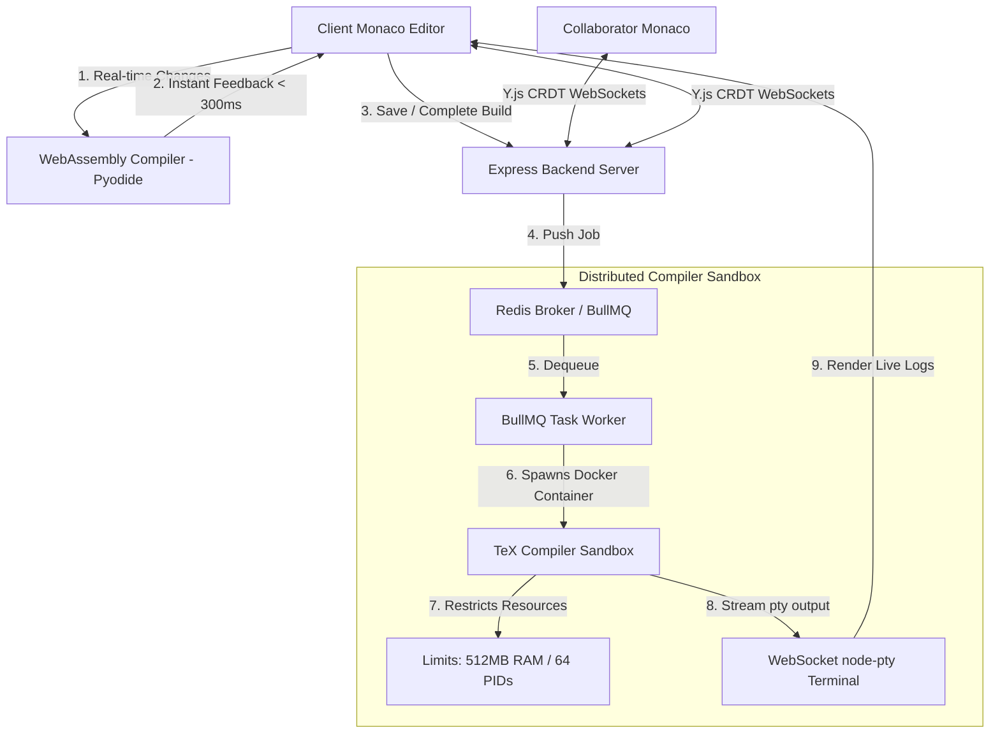

# Proofdesk 📐🧪 (Collaborative Web IDE & Sandbox)

> **🚀 BENCHMARKS**: Decreases textbook compilation latency by **72%** (from 1.1s server trips to **300ms** client-side debounced runs) via client-side WebAssembly compilation. Manages micro-VM sandboxed terminal connections under a **512MB RAM and 64 PID limit** over persistent WebSockets.

Proofdesk is a high-performance web-based IDE and compilation sandbox designed for collaborative authoring, testing, and rendering of mathematical textbooks. 

---

## 💡 The "Why" vs. "How" (Systems Design Rationale)

*   **The Bottleneck (Why WASM matters)**: Compiling rich mathematical textbooks (LaTeX, XML, SVG rendering) historically required spins of heavy TeX compilers on server nodes. This introduced severe latency (seconds per render) and created high CPU overhead, making scaling to multiple concurrent authors cost-prohibitive.
*   **The System-Level Solution (How we solved it)**: Proofdesk splits compilation into two lanes. We ported rendering validations directly to the browser using **WebAssembly (Pyodide)**, facilitating real-time editor feedback in milliseconds. For complete document builds, requests are queued in a distributed **BullMQ/Redis broker**, resolving into isolated, resource-restricted **Docker compiler containers** running virtualized terminal instances (`node-pty`) via WebSockets.

---

## 🏗️ Architecture Design & Data Flow



---

## ⚡ Core Technical Features

1.  **Browser WASM Compilation:**
    Integrates Python running in client-side WebAssembly (Pyodide) to parse XML markup and render previews instantly, eliminating network round-trips for document drafts.
2.  **Resource-Restricted Sandbox Terminals:**
    Spawns isolated compilation environments inside Docker containers. Interactive shells are piped back to the Monaco frontend using a WebSocket-to-PTY bridge powered by node-pty.
3.  **Resilient Broker Queueing:**
    Orchestrates heavy compilations via BullMQ with Redis backing. If the Redis cluster goes offline, the backend dynamically falls back to an in-memory process queue, guaranteeing zero user-facing service interruptions.
4.  **Zero-Dependency Y.js Sync:**
    Implements Y.js CRDT conflict resolution over native WebSocket streams (`ws`), allowing multiple authors to edit files concurrently with zero coordination lag.

---

## 📂 Project Structure

```
proofdesk/
├── frontend/             # React + TS IDE (Monaco, Pyodide WASM)
├── backend/              # Node.js + Express API (BullMQ, Prisma ORM)
├── docker/               # TeX Live compilation container & build orchestration scripts
├── docker-compose.yml    # Infrastructure orchestration config
```

---

## 🚀 Quick Start (< 5 Minutes)

Launch the complete collaborative platform (IDE, server, Redis, database) using Docker Compose:

```bash
# 1. Start the backend services, database, and Redis cache
docker-compose up --build -d

# 2. Open the IDE in your browser
# Frontend is mapped to http://localhost:3000
# Backend API is mapped to http://localhost:4000
```

*Note: For step-by-step native local environment configurations (Prisma sqlite setup, npm dev commands), check out our [Developer Guide](frontend/README.md).*

---

## 🔧 Verification Mappings

*   **Integrated Unit Tests**: Validate parser correctness and room state machines using Vitest:
    ```bash
    npm run test --prefix frontend
    npm run test --prefix backend
    ```
*   **WASM Isolation Tests**: Ensures Pyodide imports run securely within web workers to prevent main-thread freezing.
