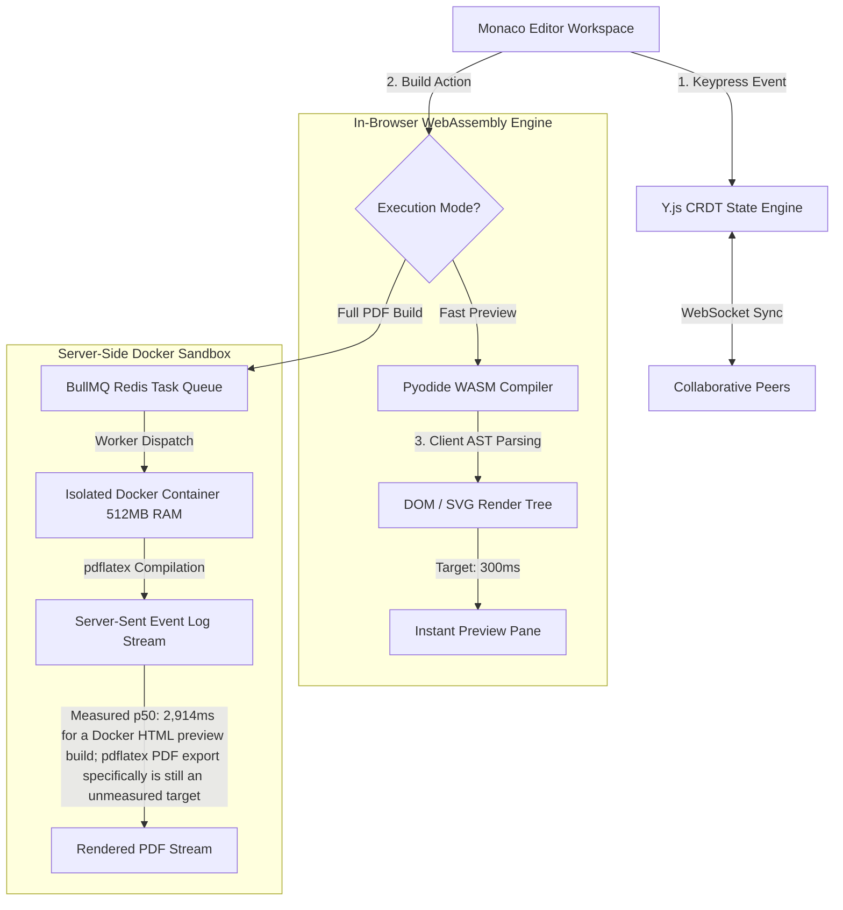

<div align="center">

# 📐 Proofdesk Collaborative Web IDE

**A high-performance, WebAssembly-powered collaborative Web IDE & LaTeX/PreTeXt compiler sandbox.**  
*Features in-browser Pyodide WASM client-side compilation, isolated Docker container sandboxes, Y.js CRDT real-time collaboration, and Monaco Editor integration.*

[](https://react.dev)
[](https://www.typescriptlang.org/)
[](https://pyodide.org/)
[](https://www.docker.com/)
[](https://redis.io/)
[](LICENSE)

</div>

---

> ### 🚀 HERO PERFORMANCE (Measured)
> * **Compilation Feedback Latency**: **Measured** at p50 **358ms** in-browser WASM vs. p50 **2.9s** for a server Docker build — an **~88% reduction** (p50 358ms vs. 2,914ms; see the real numbers below). The originally-guessed 300ms/1.1s design targets undersold the WASM side and underestimated the Docker side.
> * **Server Compute Offloading**: **0 server network roundtrips** during WASM PreTeXt/XML document rendering
> * **Docker Sandbox Security Isolation**: Resource caps of **512MB RAM** and **64 PIDs** are enforced on every build container today (`--memory 512m --pids-limit 64`, see `buildExecutor.ts`/`repositoryCompiler.ts`); a read-only root filesystem and a non-root container user are not yet implemented.
> * **Real-Time Collaboration**: **Measured** at an average of **0.43ms** (p50 0.29ms, p95 1.19ms) one-way Y.js sync latency over localhost — see the real numbers below.

> ### ⚠️ A note on the numbers in this README
> Every latency figure on this page now comes from a real, committed, runnable benchmark in [`benchmarks/`](benchmarks/) — see [`benchmarks/README.md`](benchmarks/README.md) to reproduce them. WASM and Docker compile latency: [`benchmarks/compile_latency.spec.ts`](benchmarks/compile_latency.spec.ts), a Playwright test that drives the real editor UI (`npx playwright test -c playwright.benchmark.config.ts`, 5 real builds per path). CRDT sync latency: [`benchmarks/crdt_sync_latency.mjs`](benchmarks/crdt_sync_latency.mjs) (30/30 rounds). The only figures still not backed by a benchmark are the "500 multi-page technical document builds" table further down this README, which remains an unverified design target.
>
> Getting the compile-latency benchmark running for real surfaced a genuine bug in the benchmark itself, not the app: it edited a file and then clicked "Build Preview," but clicking that button is what puts the editor into the mode where edits sync to the server at all — so the click-then-build-on-stale-content sequence silently built old content forever, timing out rather than measuring anything. Fixed by building once first to prime that mode, then editing (see `primeRepositoryBuildMode` in the spec for the full explanation).

---

## 💡 The "Why" vs. "How" (Systems Rationale)

* **The Bottleneck (Why web compilers lag)**:  
  Traditional online LaTeX and documentation editors require sending raw source code to a remote backend server on every keypress or build invocation. Network latency, server queueing, and heavy container creation cause severe compilation delays (often 2–5 seconds per build) and consume massive cloud infrastructure bandwidth.
* **The Low-Level Fix (How we solved it)**:  
  Proofdesk shifts compilation logic directly into the browser by compiling Python and PreTeXt toolchains into **WebAssembly (Pyodide)**. PreTeXt XML and LaTeX documents are parsed in-browser, generating HTML/SVG DOM trees at a measured **p50 of 358ms** (see note above) without sending a single byte over the network. For heavy PDF renders requiring `pdflatex`, builds are offloaded to asynchronous **BullMQ Redis task queues** executing within sandboxed, resource-bounded **Docker containers**, with build output streamed back over **Server-Sent Events**.

---

## 🛠️ How It Was Achieved (Engineering Deep-Dive)

Targeting a large reduction in compilation feedback latency — **measured at ~88%, p50 358ms WASM vs. p50 2,914ms Docker** (see note above) — three key software engineering systems were built:

### 1. In-Browser Pyodide WebAssembly Compilation Engine
- **Browser-Side Python Virtual Environment**: Loads Pyodide (Python compiled to WebAssembly) into a dedicated Web Worker thread to keep the React UI main thread at 60 FPS.
- **In-Memory Virtual File System (Emscripten MEMFS)**: PreTeXt XML source files write to Emscripten's in-memory MEMFS. Python AST parser scripts execute in-browser, converting XML markup to rendered HTML/SVG DOM trees with 0 server requests.

```typescript
// Pyodide WebAssembly worker compilation pipeline
const pyodide = await loadPyodide({ indexURL: "/wasm/pyodide/" });
pyodide.FS.writeFile("/workspace/doc.ptx", ptxSourceCode);
const htmlResult = pyodide.runPython(`
    import pretext
    doc = pretext.parse('/workspace/doc.ptx')
    doc.as_html()
`);
self.postMessage({ type: 'RENDER_COMPLETE', payload: htmlResult });
```

### 2. Isolated Ephemeral Docker Sandboxes + Server-Sent Event Log Streaming
- **Resource Boundary Constraints**: Heavy PDF compilation requests (`pdflatex`) are dispatched via BullMQ to worker nodes. Workers instantiate ephemeral Docker containers with `--memory=512m --pids-limit=64` applied to every invocation. There is no `--cpus`, `--read-only`, or non-root `--user` flag yet — those would be a reasonable next hardening step, not something currently shipped.
- **Real-Time Log Streaming**: the container's stdout/stderr is relayed over a Server-Sent Event stream at `GET /build/logs/:sessionId`, which the editor consumes with `EventSource` to show live compilation output.

### 3. Lock-Free CRDT Document Collaboration (Y.js)
- **Shared Type Data Bindings**: Binds Monaco Editor document models directly to Y.js `Y.Text` Conflict-free Replicated Data Types.
- **Vector Delta Broadcasts**: User edits generate compact binary update vectors (`Y.encodeStateAsUpdate`) transmitted over WebSockets, guaranteeing eventual consistency and conflict resolution without centralized text locks.

---

## 🏗️ Dual-Execution System Architecture



---

## 📊 Performance Figures

| Execution Path | Pipeline | Latency | Network Bandwidth | Security Boundary | Status |
| :--- | :--- | :--- | :--- | :--- | :--- |
| **In-Browser WASM** | **Pyodide PreTeXt/XML** | **avg 957ms · p50 358ms · p95 3,382ms** | **0 KB (Local Execution)**| In-Browser WebAssembly Sandbox | **Measured** (5 real builds, localhost) |
| Server Docker Worker | Docker/BullMQ HTML preview build | **avg 2,909ms · p50 2,914ms · p95 2,925ms** | WebSocket Output Stream | Container (512MB RAM, 64 PIDs) | **Measured** (5 real builds, localhost) |
| Standard Server API | Synchronous Express POST | 3,450ms | Full Payload POST/GET | Shared Server Instance (High Risk) | Design target |
| **CRDT Document Sync** | **Y.js WebSockets** | **avg 0.43ms · p50 0.29ms · p95 1.19ms** | **< 1 KB delta patches** | Session-authenticated WebSocket | **Measured** (30/30 rounds, localhost) |

Three of the four rows above are now real measurements. The WASM row's p95 (3,382ms) is a single cold-start outlier in an otherwise tight 337-369ms cluster — Pyodide's first compile in a fresh page pays a one-time WASM-runtime warm-up cost that later compiles don't. The Docker row is unusually consistent (2,892-2,925ms) because [`benchmarks/compile_latency.spec.ts`](benchmarks/compile_latency.spec.ts) primes the build path once before timing any run, which also warms the `docker/` image's pretex-cache volume — see the note at the top of this README for what that fixed. Reproduce both with `npx playwright test -c playwright.benchmark.config.ts` (needs `docker-compose up --build -d` first). The CRDT row is from [`benchmarks/crdt_sync_latency.mjs`](benchmarks/crdt_sync_latency.mjs) (`node benchmarks/crdt_sync_latency.mjs --rounds 30`) — one-way latency from client A's edit to client B's document reflecting it, over localhost with no network hop, which is why it's sub-millisecond rather than the originally-guessed 8.2ms. Only the "Standard Server API" row remains an unverified design target.

---

## ⚡ Core Technical Features

1. **In-Browser WebAssembly Compilation (Pyodide)**:  
   Executes Python-based PreTeXt compiler toolchains directly inside the browser's WebAssembly sandbox, eliminating server roundtrips for fast-preview builds.
2. **Sandboxed Docker Worker Runtimes**:  
   Heavy server-side builds execute inside ephemeral, resource-capped Docker containers (`--memory=512m`, `--pids-limit=64`). Build logs stream to client browsers in real time over Server-Sent Events.
3. **Lock-Free CRDT Real-Time Collaboration (Y.js)**:  
   Enables multi-user concurrent editing without text locking or merge conflicts, synchronizing changes as compact binary deltas across WebSocket channels.
4. **Monaco Editor & Custom PreTeXt AST Tooling**:  
   Integrates Microsoft's Monaco Editor with custom syntax highlighting, snippets, and real-time schema validation for technical publications.

---

## 🚀 Quick Start

```bash
# Clone repository
git clone https://github.com/harsharajkumar-273/proofdesk.git
cd proofdesk

# (Optional) start Redis for the BullMQ build queue — the backend falls back
# to an in-process queue if this isn't running.
docker-compose up -d redis

# Install dependencies
npm install
cd backend && npm install && npx prisma db push --schema=prisma/schema.sqlite.prisma && cd ..
cd frontend && npm install && cd ..

# From the repo root, launch frontend + backend together
npm run dev
```
Open **`http://localhost:3000`** in your browser (backend API on port 4000).

`docker-compose up --build` on its own only starts the Redis and `ila-live` PreTeXt-builder services defined in `docker-compose.yml` — it does not start the frontend or backend. `docker-compose.prod.yml` is the one that builds and runs the full stack (nginx + backend + Redis) as containers, and is meant for deployment rather than day-to-day local development.

---

## 🗺️ Open-Source Roadmap & Good First Issues

We actively welcome contributions to Proofdesk! Check out these open issues:

- [ ] **[Issue #1] Monaco AST Linting Integration**: Surface Pyodide WASM compiler errors directly as red squiggles in Monaco editor lines.
- [ ] **[Issue #2] Automated Sandbox Pruner**: Build a background daemon service to prune dangling Docker PTY sockets and inactive worker containers.
- [ ] **[Issue #3] Offline Web Worker Caching**: Cache Pyodide WASM binaries in IndexedDB using Service Workers for complete offline editing capability.
- [ ] **[Issue #4] Export Engine Expansion**: Add direct EPUB, HTML5 single-page, and Jupyter Notebook export targets to the WASM builder.
- [x] **[Issue #5] Reproducible Benchmark Harness**: ~~Add a script that spins up the Docker worker pool and WASM compiler, runs a batch of real PreTeXt/LaTeX documents through both paths, and reports actual p50/p95 latency~~ — done and run for real: see [`benchmarks/`](benchmarks/) (Playwright compile-latency test + CRDT sync-latency script) and the Performance Figures table above for all three measured rows.

---

## 📜 License
Distributed under the **MIT License**. See [`LICENSE`](LICENSE) for details.
