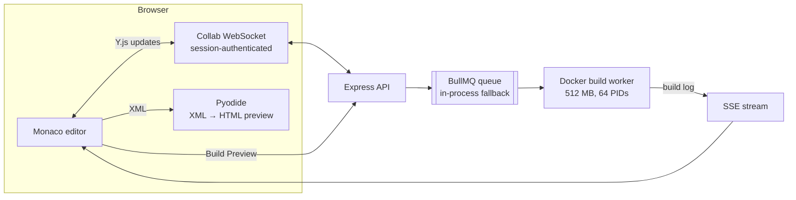

# Proofdesk

A collaborative web editor for PreTeXt textbooks. Authors edit together in a Monaco editor synced with Y.js, see an instant in-browser HTML preview, and run full builds on the server in resource-capped Docker containers fed by a job queue.

[](https://react.dev)
[](https://www.typescriptlang.org/)
[](https://yjs.dev)
[](https://bullmq.io)
[](https://playwright.dev)

| | |
|---|---|
| **Browser preview** | 358 ms median (avg 957 ms, p95 3,382 ms) for the in-browser XML-to-HTML preview, 5 local runs |
| **Server build** | 2,914 ms median for a Docker HTML preview build, 5 local runs |
| **Collaboration** | 0.29 ms median (avg 0.43 ms, p95 1.19 ms) one-way Y.js sync over localhost, 30/30 rounds |
| **Tests** | Frontend (Vitest), backend (node:test), and Playwright end-to-end suites; CI on pushes to `main` and on pull requests |
| **Built by** | Started for the Vanderbilt Mathematics Department; now maintained in the open with contributors (see [Credits](#credits)) |

The two preview paths use different inputs and caching, so their numbers aren't a like-for-like speed comparison. They answer different questions: how fast an author sees a rough preview, and how long a full server build takes.

---

## How it works



- **Collaboration.** Each document is a Y.js `Y.Text` bound to Monaco. Edits travel as binary Y.js updates over a WebSocket. The server checks the session cookie and that the room belongs to that session's workspace before joining anyone to it.
- **Instant preview.** Pyodide runs a small Python transformer ([`wasmCompiler.ts`](frontend/src/utils/wasmCompiler.ts)) that walks the PreTeXt XML with `ElementTree` and emits HTML. No server round trip. It covers common PreTeXt elements, not the full PreTeXt toolchain.
- **Full builds.** "Build Preview" enqueues a job in BullMQ. If Redis is down, the backend falls back to an in-process queue instead of failing. Workers run the real PreTeXt build in a Docker container capped at `--memory 512m --pids-limit 64` and stream logs back over Server-Sent Events (`GET /build/logs/:sessionId`).
- **Accounts and workspaces.** GitHub sign-in, cookie sessions, git-backed workspaces, team sessions, and share links. Admin routes are gated by an allow-list (`PROOFDESK_ADMIN_LOGINS`).

More detail: [`ARCHITECTURE.md`](ARCHITECTURE.md), [`docs/system-design.md`](docs/system-design.md), [`docs/api-spec.md`](docs/api-spec.md).

---

## Benchmarks

Both are committed and runnable. See [`benchmarks/README.md`](benchmarks/README.md).

```bash
# Browser preview vs. server build (drives the real editor UI, 5 builds per path)
npx playwright test -c playwright.benchmark.config.ts

# Y.js sync latency over the authenticated collab WebSocket (30 rounds)
node benchmarks/crdt_sync_latency.mjs
```

| Path | Avg | p50 | p95 | Samples |
|---|---|---|---|---|
| In-browser XML preview (Pyodide) | 957 ms | 358 ms | 3,382 ms | 5 |
| Server Docker HTML preview build | 2,909 ms | 2,914 ms | 2,925 ms | 5 |
| Y.js one-way sync | 0.43 ms | 0.29 ms | 1.19 ms | 30 |

All runs were on localhost with small samples, so treat the browser preview's wide spread (358 ms median, 3.4 s p95) as unexplained until it's measured with more runs.

---

## Quick start

```bash
git clone https://github.com/harsharajkumar-273/Proofdesk.git
cd Proofdesk

# Optional: Redis for the BullMQ queue (the backend falls back to an in-process queue without it)
docker-compose up -d redis

npm install
cd backend && npm install && npx prisma db push --schema=prisma/schema.sqlite.prisma && cd ..
cd frontend && npm install && cd ..

npm run dev   # frontend on :3000, backend API on :4000
```

`docker-compose.prod.yml` builds and runs the full stack (nginx, backend, Redis) for deployment. Deploy workflows for AWS EC2 and Oracle Cloud are in [`.github/workflows`](.github/workflows), with guides in [`docs/`](docs/).

```bash
npm test            # frontend + backend unit tests
npm run test:e2e    # Playwright end-to-end tests
```

---

## Limitations

- The in-browser preview handles a subset of PreTeXt. Anything it doesn't support needs a server build.
- Build containers have memory and process limits but no read-only root filesystem or non-root user yet.
- Benchmarks are small local samples (5 builds per path), not production measurements.

---

## Credits

Proofdesk was started by [@harsharajkumar-273](https://github.com/harsharajkumar-273) for the Vanderbilt Mathematics Department and has been developed in the open since, including during the ELUSOC 2026 open-source program. Contributors:

- [@SakethSumanBathini](https://github.com/SakethSumanBathini): security and authorization fixes (preview ownership, collab room authorization, comment scoping), Redis subscription retries, build-timeout container cleanup, session-cache indexing, and more
- [@rohitkumarnaidu](https://github.com/rohitkumarnaidu) (Bappadala Rohith Kumar Naidu): features from the issue tracker
- [@sanket1035](https://github.com/sanket1035): fixes and improvements

See the [merged pull requests](https://github.com/harsharajkumar-273/Proofdesk/pulls?q=is%3Apr+is%3Amerged) and [`CONTRIBUTING.md`](CONTRIBUTING.md) to get involved.

## License

This repository doesn't have a license file yet, so default copyright applies. A license will be added before the code is offered for reuse.
