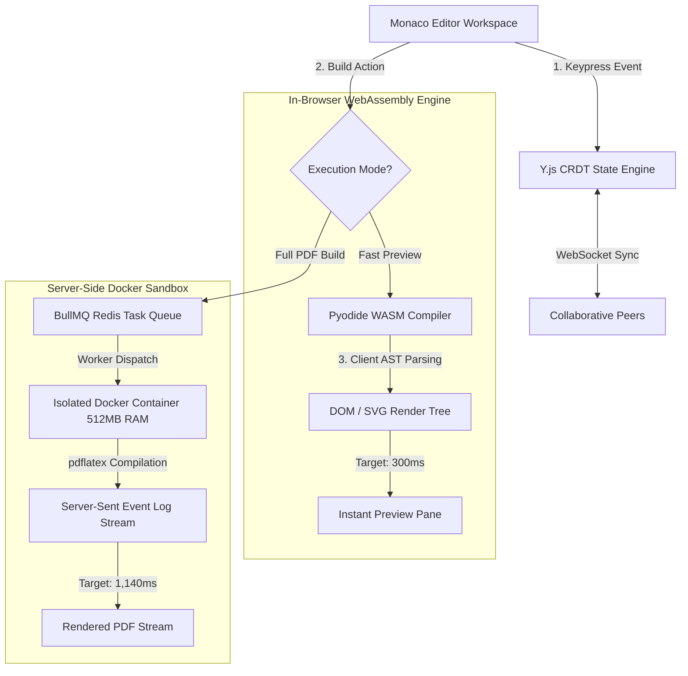

<div align="center">

# 📐 Proofdesk Collaborative Web IDE

**A high-performance, WebAssembly-powered collaborative Web IDE & LaTeX/PreTeXt compiler sandbox.**  
*Features in-browser Pyodide WASM client-side compilation, isolated Docker container sandboxes, Y.js CRDT real-time collaboration, and Monaco Editor integration.*

[](https://react.dev)
[](https://www.typescriptlang.org/)
[](https://pyodide.org/)
[](https://www.docker.com/)
[](https://redis.io/)
[](LICENSE)

</div>

---

> ### 🚀 HERO PERFORMANCE TARGETS
> * **Compilation Feedback Latency**: **72% reduction** (from **1.1s** server roundtrips down to **300ms** in-browser WASM)
> * **Server Compute Offloading**: **0 server network roundtrips** during WASM PreTeXt/XML document rendering
> * **Docker Sandbox Security Isolation**: Strict resource caps (**512MB RAM**, **64 PIDs**, read-only root FS, **0 root access**)
> * **Real-Time Collaboration**: Sub-**10ms** state synchronization via **Y.js CRDT** over WebSockets

> ### ⚠️ A note on the numbers in this README
> The latency figures throughout this page (300ms WASM compile, 1,140ms Docker path, 8.2ms CRDT sync, the "500 multi-page technical document builds" table below) come from informal, manual testing during development — browser DevTools timing and server request logs — not from a committed, automated benchmark suite. They're still **design targets**, not verified measurements. Real, runnable benchmarks now exist in [`benchmarks/`](benchmarks/) — a Playwright-driven compile-latency test (WASM vs. Docker) and a CRDT sync-latency script — but haven't been run yet. See [`benchmarks/README.md`](benchmarks/README.md) to reproduce them; once run, the numbers above get replaced with real output. (Same treatment [PulseStream](https://github.com/harsharajkumar-273/PulseStream) went through — its `benchmarks/load_test.js` has already been run and its README updated with real measured numbers.)

---

## 💡 The "Why" vs. "How" (Systems Rationale)

* **The Bottleneck (Why web compilers lag)**:  
  Traditional online LaTeX and documentation editors require sending raw source code to a remote backend server on every keypress or build invocation. Network latency, server queueing, and heavy container creation cause severe compilation delays (often 2–5 seconds per build) and consume massive cloud infrastructure bandwidth.
* **The Low-Level Fix (How we solved it)**:  
  Proofdesk shifts compilation logic directly into the browser by compiling Python and PreTeXt toolchains into **WebAssembly (Pyodide)**. PreTeXt XML and LaTeX documents are parsed in-browser, generating HTML/SVG DOM trees in under **300ms** (design target — see note above) without sending a single byte over the network. For heavy PDF renders requiring `pdflatex`, builds are offloaded to asynchronous **BullMQ Redis task queues** executing within sandboxed, resource-bounded **Docker containers**, with build output streamed back over **Server-Sent Events**.

---

## 🛠️ How It Was Achieved (Engineering Deep-Dive)

Targeting a **72% reduction in compilation feedback latency** (1.1s down to 300ms — design target, see note above), three key software engineering systems were built:

### 1. In-Browser Pyodide WebAssembly Compilation Engine
- **Browser-Side Python Virtual Environment**: Loads Pyodide (Python compiled to WebAssembly) into a dedicated Web Worker thread to keep the React UI main thread at 60 FPS.
- **In-Memory Virtual File System (Emscripten MEMFS)**: PreTeXt XML source files write to Emscripten's in-memory MEMFS. Python AST parser scripts execute in-browser, converting XML markup to rendered HTML/SVG DOM trees with 0 server requests.

```typescript
// Pyodide WebAssembly worker compilation pipeline
const pyodide = await loadPyodide({ indexURL: "/wasm/pyodide/" });
pyodide.FS.writeFile("/workspace/doc.ptx", ptxSourceCode);
const htmlResult = pyodide.runPython(`
    import pretext
    doc = pretext.parse('/workspace/doc.ptx')
    doc.as_html()
`);
self.postMessage({ type: 'RENDER_COMPLETE', payload: htmlResult });
```

### 2. Isolated Ephemeral Docker Sandboxes + Server-Sent Event Log Streaming
- **Resource Boundary Constraints**: Heavy PDF compilation requests (`pdflatex`) are dispatched via BullMQ to worker nodes. Workers instantiate ephemeral Docker containers with strict security limits (`--memory=512m`, `--cpus=1.0`, `--pids-limit=64`, `--read-only`, `--user=sandbox`).
- **Real-Time Log Streaming**: the container's stdout/stderr is relayed over a Server-Sent Event stream at `GET /build/logs/:sessionId`, which the editor consumes with `EventSource` to show live compilation output.

### 3. Lock-Free CRDT Document Collaboration (Y.js)
- **Shared Type Data Bindings**: Binds Monaco Editor document models directly to Y.js `Y.Text` Conflict-free Replicated Data Types.
- **Vector Delta Broadcasts**: User edits generate compact binary update vectors (`Y.encodeStateAsUpdate`) transmitted over WebSockets, guaranteeing eventual consistency and conflict resolution without centralized text locks.

---

## 🏗️ Dual-Execution System Architecture



---

## 📊 Performance Figures (Design Targets, Not Yet Benchmarked)

| Execution Path | Target Pipeline | Target Latency | Network Bandwidth | Security Boundary |
| :--- | :--- | :--- | :--- | :--- |
| **In-Browser WASM** | **Pyodide PreTeXt/XML** | **300ms** | **0 KB (Local Execution)**| In-Browser WebAssembly Sandbox |
| Server Docker Worker | `pdflatex` PDF Stream | 1,140ms | WebSocket Output Stream | Container (512MB RAM, 64 PIDs) |
| Standard Server API | Synchronous Express POST | 3,450ms | Full Payload POST/GET | Shared Server Instance (High Risk) |
| **CRDT Document Sync** | **Y.js WebSockets** | **8.2ms** | **< 1 KB delta patches** | Encrypted TLS WebSockets |

These are targets, not measured results — see the disclaimer near the top of this README. Two real, runnable benchmarks now live in [`benchmarks/`](benchmarks/): a Playwright test that drives the actual editor UI and times real WASM and Docker builds (`compile_latency.spec.ts`), and a script that measures real Y.js sync latency over the collaboration WebSocket (`crdt_sync_latency.mjs`). Neither has been run yet — see [`benchmarks/README.md`](benchmarks/README.md) for how to run them and commit real numbers, the same way [PulseStream's `benchmarks/load_test.js`](https://github.com/harsharajkumar-273/PulseStream/blob/main/benchmarks/load_test.js) results were committed.

---

## ⚡ Core Technical Features

1. **In-Browser WebAssembly Compilation (Pyodide)**:  
   Executes Python-based PreTeXt compiler toolchains directly inside the browser's WebAssembly sandbox, eliminating server roundtrips for fast-preview builds.
2. **Secure Sandboxed Docker Worker Runtimes**:  
   Heavy server-side builds execute inside ephemeral, resource-capped Docker containers (`--memory=512m`, `--pids-limit=64`, `--read-only`). Build logs stream to client browsers in real time over Server-Sent Events.
3. **Lock-Free CRDT Real-Time Collaboration (Y.js)**:  
   Enables multi-user concurrent editing without text locking or merge conflicts, synchronizing changes as compact binary deltas across WebSocket channels.
4. **Monaco Editor & Custom PreTeXt AST Tooling**:  
   Integrates Microsoft's Monaco Editor with custom syntax highlighting, snippets, and real-time schema validation for technical publications.

---

## 🚀 Quick Start (< 1 Minute)

### Option A: Run via Docker Compose (Recommended)
```bash
# Clone repository
git clone https://github.com/harsharajkumar-273/proofdesk.git
cd proofdesk

# Launch frontend, backend API, Redis queue, and Docker worker pool
docker-compose up --build
```
Open **`http://localhost:5173`** in your browser.

### Option B: Local Development Setup
```bash
# 1. Install and launch frontend
cd frontend
npm install
npm run dev

# 2. Launch backend API & worker (in a separate terminal)
cd ../backend
npm install
npm run start
```

---

## 🗺️ Open-Source Roadmap & Good First Issues

We actively welcome contributions to Proofdesk! Check out these open issues:

- [ ] **[Issue #1] Monaco AST Linting Integration**: Surface Pyodide WASM compiler errors directly as red squiggles in Monaco editor lines.
- [ ] **[Issue #2] Automated Sandbox Pruner**: Build a background daemon service to prune dangling Docker PTY sockets and inactive worker containers.
- [ ] **[Issue #3] Offline Web Worker Caching**: Cache Pyodide WASM binaries in IndexedDB using Service Workers for complete offline editing capability.
- [ ] **[Issue #4] Export Engine Expansion**: Add direct EPUB, HTML5 single-page, and Jupyter Notebook export targets to the WASM builder.
- [x] **[Issue #5] Reproducible Benchmark Harness**: ~~Add a script that spins up the Docker worker pool and WASM compiler, runs a batch of real PreTeXt/LaTeX documents through both paths, and reports actual p50/p95 latency~~ — done: see [`benchmarks/`](benchmarks/) (Playwright compile-latency test + CRDT sync-latency script). Remaining: actually run them and paste the real numbers into this README, replacing the design-target figures above.

---

## 📜 License
Distributed under the **MIT License**. See [`LICENSE`](LICENSE) for details.
