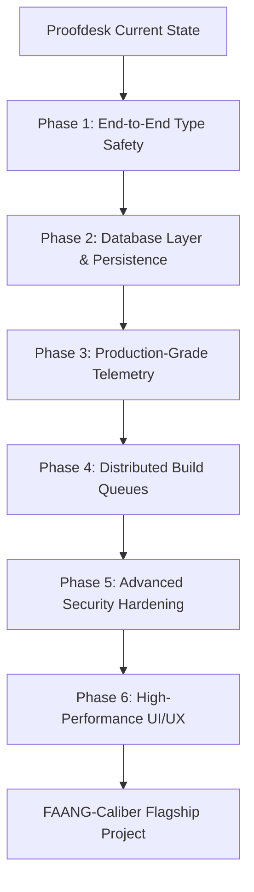
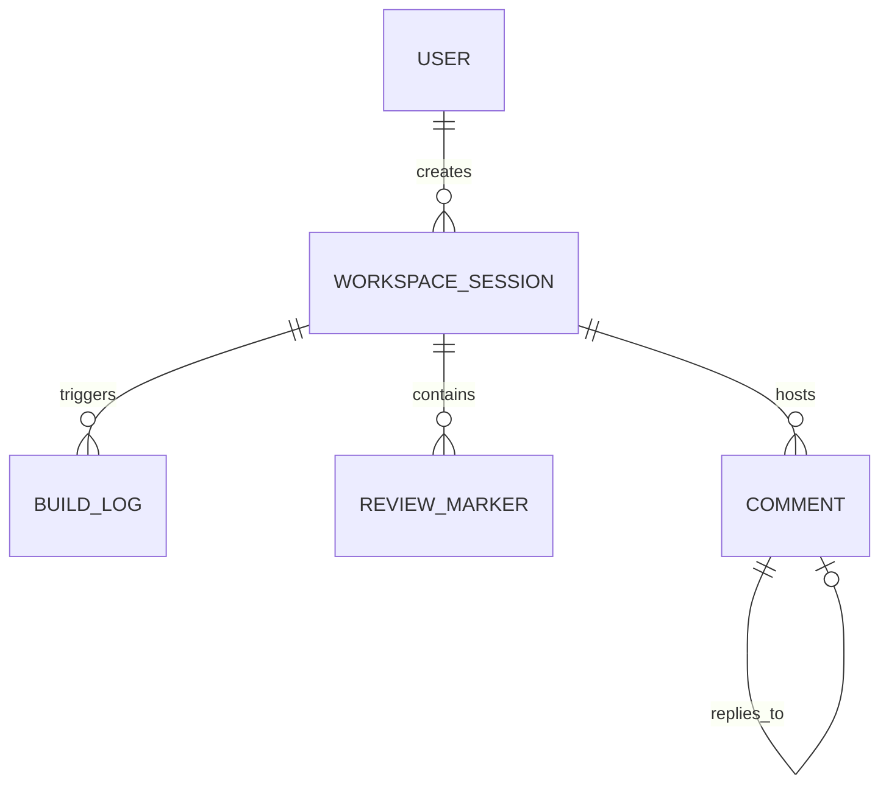
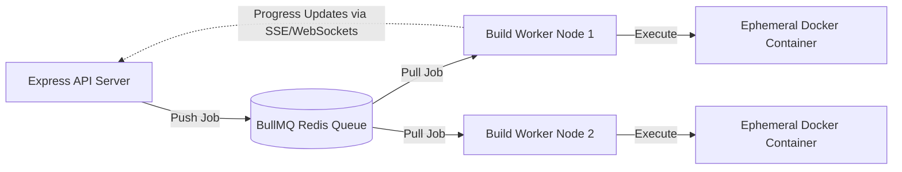

# Proofdesk — FAANG Portfolio Roadmap

This document outlines an architectural analysis and execution strategy to elevate **Proofdesk** from a fully functional prototype into a top-tier "flagship" portfolio project designed to stand out in FAANG (Meta, Apple, Amazon, Netflix, Google) interviews.

FAANG hiring committees look for candidates who can solve complex engineering challenges, build for scale, write clean, production-grade code, and demonstrate a deep understanding of systems design, security, and observability.

---

## 🏗️ Architectural Evaluation: Proofdesk Today vs. FAANG Expectations

| Criteria | Current State (Proofdesk) | FAANG Production Target | Gaps & Opportunities |
| :--- | :--- | :--- | :--- |
| **Language & Safety** | Node.js (ES6 JavaScript) backend, TS frontend. | Strict TypeScript end-to-end, compiled with compilation safeguards. | Missing type safety on backend interfaces and database/API schemas. |
| **State & Persistence** | In-memory objects, Redis for collab, local JSON files for reviews/tokens. | Relational Database (e.g., PostgreSQL) with transactional integrity. | Session state is transient and files are stored locally without transactional db backup. |
| **Scalability & Compute** | Docker builds run synchronously or via in-memory session blocks on the main Express thread. | Distributed job queues (e.g., BullMQ) with isolated stateless build workers. | Heavy PreTeXt builds can starve resources or crash the main server under load. |
| **Observability** | Console logs, custom client error routes, and simple local files. | Structured JSON logging, OpenTelemetry integration, Prometheus metrics, Grafana dashboards. | No real-time telemetry, alert triggers, or centralized tracing of build/WebSocket pipes. |
| **Security & Isolation** | Optional Docker terminal runtime; mostly local filesystem paths; token in session cookie. | Mandatory sandboxed gRPC/Docker runtimes, micro-segmentation, TLS everywhere, Vault for secrets. | Terminal execution defaults to host; secrets exist in plaintext `.env` configurations. |
| **Testing & CI/CD** | Unit + Supertest + Playwright (Sanity). | Code coverage targets (>80%), automated migrations, security scanning (Snyk/SonarQube). | Lacks pipeline validation for code quality, dependency vulnerabilities, or database drift. |

---

## 🗺️ The FAANG-Stature Roadmap

To bridge these gaps, we propose a modular, step-by-step upgrade strategy. Each phase is designed to showcase specific engineering competencies that FAANG interviewers prioritize.



---

### Phase 1: End-to-End Type Safety & Clean Architecture
**Goal:** Show high code quality, predictability, and architecture discipline by converting the backend to TypeScript and separating concerns.

1. **Backend TypeScript Migration:**
   - Rename `backend/src/**/*.js` to `backend/src/**/*.ts`.
   - Setup a strict `tsconfig.json` (`"strict": true`, `"noImplicitAny": true`, `"target": "ES2022"`).
2. **Layered Architecture (Clean/Hexagonal Architecture):**
   - Refactor the code from single large modules (e.g., [server.js](file:///Users/harsharajkumar/Downloads/projects/proofdesk/backend/src/server.js)) into clean layers:
     - **Controllers/Handlers:** Express route parsing and request validation.
     - **Services:** Pure business logic (e.g., compilation scheduler, GitHub synchronizer).
     - **Repositories:** Abstract interfaces to interact with storage (making it storage-agnostic).
3. **API Contracts:**
   - Introduce **tRPC** or **OpenAPI / Swagger** documentation. end-to-end type safety between frontend and backend makes APIs self-documenting and less prone to breaking.

---

### Phase 2: Database Layer & Schema Migrations
**Goal:** Prove you can design scalable relational structures, manage data persistence, and control state transitions cleanly.



1. **Database Integration:**
   - Integrate **PostgreSQL** as the primary storage engine.
   - Use **Prisma** or **TypeORM** to manage schema migrations.
2. **Data Modeling:**
   - **Users:** Store GitHub/Google ID, name, email, OAuth scope profile.
   - **Workspace Sessions:** Session ID, repository owner/name, commit hashes, creation meta, and build status.
   - **Review Markers & Comments:** Store annotations, comments, lines, and resolution state.
   - **Build Logs:** Track every compile execution, build durations, and success/failure logs for historical review.
3. **Database Migration Pipeline:**
   - Integrate migration scripts into the CI/CD pipeline so migrations are applied automatically during deployment validation.

---

### Phase 3: Production-Grade Telemetry & Observability
**Goal:** Demonstrate a "production first" mindset by instrumenting the code to be fully observable. FAANG engineers live in dashboards.

1. **Structured Logging:**
   - Replace standard `console.log` with a structured JSON logging library like **Pino** or **Winston**. Ensure logs output standard keys: `timestamp`, `level`, `requestId` (tracked via request middleware), and context payloads.
2. **OpenTelemetry & Prometheus Metrics:**
   - Expose an endpoint `/metrics` for Prometheus scraping.
   - Collect metrics such as:
     - `http_request_duration_seconds`: API latency histograms.
     - `docker_build_duration_seconds`: Build speed distribution.
     - `websocket_active_connections`: Real-time active collaboration counts.
     - `active_build_jobs`: Count of current concurrent compilation runners.
3. **Tracing & Telemetry Visuals:**
   - Wire up trace contexts to follow requests from the React frontend, through Express middleware, into the Docker build subprocess, and down to the filesystem. Provide a Grafana dashboard screenshot in your repo to prove it.

---

### Phase 4: Distributed Scaling & Decoupled Build Workers
**Goal:** Solve a major architectural bottleneck: compiling mathematical textbooks takes significant resources. Decouple long-running jobs from the main API.



1. **Distributed Queue System:**
   - Refactor `buildExecutor.js` to push build tasks onto a **BullMQ** or **RabbitMQ** queue hosted on Redis.
2. **Stateless Build Workers:**
   - Create a separate Node.js worker service that listens to the queue, pulls jobs, provisions/mounts the directories, and runs the Docker pretext compilation task.
   - If a build worker crashes or goes out of memory, it doesn't affect the user-facing web server.
3. **Dynamic Infrastructure Integration:**
   - For extra credit: configure the workers to spin up ephemeral tasks in **AWS ECS (Fargate)** or **GCP Cloud Run** rather than running local host Docker commands, keeping the main hosting environment lightweight.

---

### Phase 5: Advanced Security Hardening & Isolation [Completed]
**Goal:** Showcase deep security knowledge by resolving high-risk vulnerabilities like remote code execution in terminals.

> [!WARNING]
> Spawning a terminal (`node-pty`) directly on the host server means that if a user breaks out of their restricted shell, they gain full root-level control of your production system.

1. **Mandatory Terminal Containerization:**
   - Deprecate `process` terminal execution entirely in production.
   - Force all terminal instances to boot inside micro-containers with strictly limited resources (`--memory=512m`, `--pids-limit=64`), no network access (`--network=none`), and dropped capabilities (`--cap-drop=ALL`).
2. **Static Application Security Testing (SAST):**
   - Integrate tools like **Snyk** or **SonarQube** in GitHub Actions to audit dependencies and scan for path traversal and SQL injection vulnerabilities.
3. **Secret Encryption:**
   - Encrypt credentials and user OAuth tokens in the database using AES-256-GCM.

---

### Phase 6: High-Fidelity UI/UX & Web Performance
**Goal:** Provide the "wow factor" through animations, responsiveness, and advanced UI integrations.

1. **Visual Outline & Graph Analysis:**
   - Implement the **Dependency Graph Explorer** (using Cytoscape.js or D3.js) to show structural maps of chapters, sections, and cross-references.
2. **Monaco Editor Enhancements:**
   - Optimize Monaco markers and linter cycles. Debounce validation routines to prevent typing lag.
   - Add inline diff editors to compare file edits with the latest Git commit side-by-side prior to pushing.
3. **Real-time Synchronization (Yjs + WebSockets):**
   - Provide visual presence dots (avatars of users actively looking at the same file), cursor synchronizations, and conflict-free concurrent editing.

---

## 🚀 Advanced FAANG "Moonshot" Features (Extra Credit)

To make your portfolio truly exceptional, consider these top-tier engineering additions. They showcase advanced system design concepts directly mapped to typical FAANG hiring targets (like LLM infrastructure, Infrastructure as Code, and graph theory).

### 1. Vector Database & RAG-based AI Tutor (AI Integration)
FAANG companies are currently heavily invested in AI infrastructure. Adding a vector-backed LLM tutor shows you understand how to process and retrieve structured information safely.
* **Architecture:**
  - Create a pipeline that parses compiled textbook HTML files, extracts sections/paragraphs, and computes embeddings (e.g., using OpenAI's `text-embedding-3-small` or Hugging Face local models).
  - Index these embeddings in a vector database like **pgvector** (as an extension in your PostgreSQL instance) or **Chroma**.
  - Build a RAG (Retrieval-Augmented Generation) query route: when a student asks the AI Tutor a question, query the vector database for the most relevant textbook context, insert it into the LLM context, and stream the generated response.
* **Why it shines:** Demonstrates modern AI engineering, data preprocessing pipelines, and retrieval security.

### 2. Infrastructure as Code (IaC) with Terraform
Manual cloud deployment instructions in a README are acceptable, but automating it via code is what FAANG teams do.
* **Architecture:**
  - Write **Terraform** configurations (`.tf` files) that model your target infrastructure (VM shape, Virtual Cloud Network/VPC, Security Lists/Firewalls, and storage buckets) on AWS or Oracle Cloud.
  - Show how resources are provisioned deterministically with one command: `terraform apply`.
* **Why it shines:** Proves mastery of modern DevOps practices, reproducible infrastructure, and cloud networking.

### 3. Incremental Build DAG (Directed Acyclic Graph)
Compiling a large PreTeXt textbook is slow. Rebuilding the whole book because of a typo is wasteful.
* **Architecture:**
  - Parse cross-reference links (`<xref>`) and inclusions between XML/PTX files to construct a **Directed Acyclic Graph (DAG)** of dependencies.
  - When a file is modified, compute its downstream path in the graph. Run selective, targeted compiler builds only for the modified file and its children.
* **Why it shines:** Demonstrates data structure application (graph traversal, topological sorting) and compilation optimization.

### 4. AST-based Custom WebAssembly Validator
Regex-based XML scanners (like the current `pretexValidator.ts`) are fragile and error-prone.
* **Architecture:**
  - Write a high-performance XML/HTML parser or validation engine in **Rust** or **C++**.
  - Compile the validation logic to **WebAssembly (WASM)**.
  - Load the WASM binary in the React frontend to perform full AST (Abstract Syntax Tree) linting on keystrokes in under 2ms.
* **Why it shines:** Demonstrates client-side execution optimization, Rust/WAssembly integration, and deep parsing knowledge.

### 5. Yjs CRDT Persistence & Document History
Collaborative editors are impressive, but they need version history.
* **Architecture:**
  - Bind a Yjs database provider (like `y-leveldb` or custom Redis adapters) to capture collaborative edit updates.
  - Store delta state vectors in PostgreSQL.
  - Build a "Document Time Machine" slider in the frontend that plays back document states historically by applying Yjs update deltas.
* **Why it shines:** Showcases an understanding of collaborative distributed systems, conflict-free data types, and state playback.

---

## 🛠️ Step-by-Step Implementation Guide for Harsha

To help you hit the ground running, let's start with the highest-leverage improvement: **Migrating the backend to TypeScript and establishing a typed validation layer.**

### Step A: Setup TypeScript configuration in `backend/`
Initialize TypeScript configuration in your backend directory:

```bash
# In backend/ directory:
npm install -D typescript @types/node @types/express typescript-eslint
npx tsc --init
```

Create a production-ready `tsconfig.json`:

```json
{
  "compilerOptions": {
    "target": "ES2022",
    "module": "NodeNext",
    "moduleResolution": "NodeNext",
    "rootDir": "./src",
    "outDir": "./dist",
    "esModuleInterop": true,
    "forceConsistentCasingInFileNames": true,
    "strict": true,
    "skipLibCheck": true
  },
  "include": ["src/**/*"]
}
```

### Step B: Build Worker decoupling (Redis + BullMQ)
Define a clean schema for build tasks and push the heavy Docker execution into a background consumer:

```typescript
// backend/src/types/build.ts
export interface BuildJobPayload {
  sessionId: string;
  xmlId?: string;
  repoPath: string;
  outputPath: string;
  notifyEmail?: string;
}

export type BuildStatus = 'queued' | 'active' | 'completed' | 'failed';
```

---

## 🚀 How to Pitch This Project in FAANG Interviews

When recruiters or hiring managers look at your GitHub profile, make sure they immediately see this project's quality.

1. **Interactive Architectural Diagram:**
   Include the Mermaid system design diagram directly in your repository's primary `README.md`.
2. **Highlight the "Scale" and "Concurrency" Challenges:**
   In your resume bullet points, don't just say *"Built a textbook editor"*. Say:
   > *"Designed and built a distributed PreTeXt textbook editor orchestrating containerized Docker builds. Decoupled compute-heavy rendering via a Redis-backed BullMQ job distribution queue, reducing server overhead and preventing CPU starvation."*
3. **Discuss Security & Isolation:**
   Explain to interviewers how you mitigated remote code execution (RCE) risks in terminal workspaces using custom PTY containers with zero network access and limited PIDs/Memory thresholds.
4. **Demonstrate Testing Coverage:**
   Showcase your multi-layered testing suite (Vitest component testing + Supertest integration testing + multi-browser Playwright E2E testing). This level of testing maturity is highly respected.
